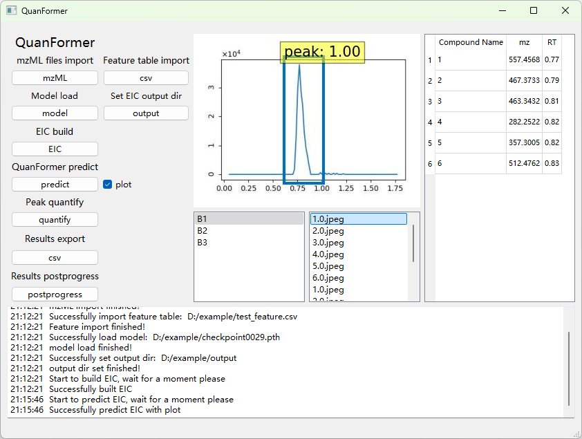

# QuanFormer

#### Description
QuanFormer is a novel approach written in Python (v3.8.1) for peaks (aka features) detection 
and quantification in raw profile LC-MS data. The main idea of this method is to train object detection network combining 
CNN and Transformer to identify the peaks in ROI (to judge whether it is a true peak or a false peak) and 
locate the peak boundaries to integrate the area. The current method is developed for high-resolution LC-MS data for 
metabolomics purposes, but it can also be applied to other detections that take peaks as the targets. 


Supported formats:

.mzML

### Operating System Compatibility
QuanFormer has been tested successfully with:
- Windows 10
- Windows 11
- Ubuntu 20.04
- macOS Sonoma


## Install Quanformer
To install and run QuanFormer you should do a few simple steps:
### 1. Create conda environment (Preinstall conda/miniconda)

```shell
conda create -n quanformer python=3.8
```

### 2. Activate environment

```shell
conda activate quanformer
```

### 3. Clone quanformer

**Note**: Make sure *checkpoint0029.pth* in /resources/ is normal (>300MB)。Or download from [weight](resources/checkpoint0029.pth)

```shell
git clone https://github.com/LinShuhaiLAB/QuanFormer.git 
```

### 4. Install pytorch

Windows/Linux with NVIDIA GPU.

```shell
pip install torch==1.13.1+cu117 torchvision==0.14.1+cu117 torchaudio==0.13.1 --extra-index-url https://download.pytorch.org/whl/cu117
```

Linux without NVIDIA GPU.
```shell
pip install torch torchvision torchaudio --index-url https://download.pytorch.org/whl/cpu
```

Windows/macOS without NVIDIA GPU.
```shell
pip install torch torchvision torchaudio
```

### 5. Install requirements

```shell
cd Quanformer

pip install -r requirements.txt
```

## Use Quanformer

### 1. Data preparation
1. prepare mzML files in the mzML folder and feature.csv
   ```python
   ├── mzML
      ├── BC1.mzML 
      ├── BC2.mzML
      └── BC3.mzML
2. if running the targeted quantification, you should prepare the feature.csv file in the following format, else ignore this step:
   ```python
   feature.csv contains the following columns:
   1. Compound Name(numbers, unique)
   2. mz
   3. RT

### 2. Parameter Descriptions

#### General parameters

- `--type`
  
  - **Default Value**: `'mzML'`
  - **Description**: Type of raw data files, currently only supports the mzML format.
- `--ppm`
  
  - **Default Value**: `10`
  - **Description**: PPM value for ROI extraction.
- `--source`
  
  - **Default Value**: `"resources/example"`
  - **Description**: Path to the raw data directory.
- `--feature`
  
  - **Default Value**: `"resources/test_feature.csv"`
  - **Description**: The path of the feature file. If it is not empty, the targeted mode will be used. If it is empty, it is the untargeted mode, and the parameters required for the untargeted mode need to be set.
- `--images_path`
  
  - **Default Value**: `"resources/example/output"`
  - **Description**: Path to the output ROI files.
- `--output`
  
  - **Default Value**: `"resources/example/output/area.csv"`
  - **Description**: Path to the output files.
- `--threshold`
  
  - **Default Value**: `0.99`
    
  - **Description**: Keep only predictions with 0.99 confidence.
    
- `--model`
  
  - **Default Value**: `"resources/checkpoint0029.pth"`
  - **Description**: Path to the peak detection model.
- `--roi_plot`
  
  - **Default Value**: `True`
  - **Description**: Whether to plot ROIs. Must be set to `True` on the first use.
- `--plot`
  
  - **Default Value**: `True`
  - **Description**: Whether to plot predictions.
- `--num_classes`
  
  - **Default Value**: `1`
  - **Description**: Number of classes.
- `--smooth_sigma`
  
  - **Default Value**: `0`
  - **Description**: Sigma value for smoothing.
- `--processes_number`
  
  - **Default Value**: `1`
  - **Description**: Number of processes.


#### Untargeted mode parameters for centWave algorithm.

- `--polarity`
  
  - **Default Value**: `'positive'`
  - **Description**: Polarity.
- `--minWidth`
  
  - **Default Value**: `5`
  - **Description**: Min peak width
- `--maxWidth`
  
  - **Default Value**: `50`
  - **Description**: Max peak width.
- `--s2n`
  
  - **Default Value**: `5`
  - **Description**: Signal-to-noise ratio.
- `--noise`
  
  - **Default Value**: `100`
  - **Description**: Noise level.
- `--mzDiff`
  
  - **Default Value**: `0.005`
  - **Description**: m/z difference.
- `--prefilter`
  
  - **Default Value**: `3`
  - **Description**: Pre-filtering parameter.

### 3. Run in command line mode.

#### 3.1 Targeted Mode

Here is an example command showing how to use these parameters in **targeted mode**, quanformer can run in both  centroided and profile data：

##### 3.1.1 Centroided data

```shell
python main.py --ppm 10 --source resources/example/centroided --feature resources/example/centroided_feature.csv --images_path resources/example/centroided_output --output resources/example/centroided_output/area.csv --model resources/checkpoint0029.pth
```

##### 3.1.2 Profile data

example download link(https://drive.google.com/drive/folders/1JopRY0mgMxRGg45iXiBgbT-i7uG3M3tS?usp=drive_link)

```shell
python main.py --ppm 10 --source resources/example/profile --feature resources/example/profile_feature.csv --images_path resources/example/profile_output --output resources/example/profile_output/area.csv --model resources/checkpoint0029.pth
```
#### 3.2 Install R before running in untargeted mode

* R version 4.4.2, xcms version 4.4.0

In view of the possible problems in downloading R packages, I have packaged my R dependency packages and put them in the following link：
( https://drive.google.com/file/d/1oEIANtyXztyRkKUcWpUh3jznCG2trHwv/view?usp=drive_link )

Before using untargeted mode, you should check whether R is installed, open the terminal and input:

```shell
R --version
```

If R and Rscript are not installed, they can be installed through the following commands. ( https://cran.r-project.org/bin/linux/ubuntu/ )

```shell
sudo apt-get update
 # update indices
sudo apt update -qq
# install two helper packages we need
sudo apt install --no-install-recommends software-properties-common dirmngr
# add the signing key (by Michael Rutter) for these repos
# To verify key, run gpg --show-keys /etc/apt/trusted.gpg.d/cran_ubuntu_key.asc 
# Fingerprint: E298A3A825C0D65DFD57CBB651716619E084DAB9
wget -qO- https://cloud.r-project.org/bin/linux/ubuntu/marutter_pubkey.asc | sudo tee -a /etc/apt/trusted.gpg.d/cran_ubuntu_key.asc
# add the R 4.0 repo from CRAN -- adjust 'focal' to 'groovy' or 'bionic' as needed
sudo add-apt-repository "deb https://cloud.r-project.org/bin/linux/ubuntu $(lsb_release -cs)-cran40/"

sudo apt install --no-install-recommends r-base
sudo apt-get install libxml2-dev
```

Then, run the following commands to install packages.(https://www.bioconductor.org/packages/release/bioc/html/xcms.html)

```shell
sudo R

if (!require("BiocManager", quietly = TRUE))
    install.packages("BiocManager")

BiocManager::install("xcms")
BiocManager::install("MSnbase")
install.packages("dplyr")
```

#### 3.3 Untargeted Mode

Finally, to run the untargeted mode, the feature parameter needs to be set to empty or not set the feature parameter (default is empty), and at the same time, additional parameters required by the centWave algorithm such as polarity, peakWidth, s2n, noise, mzDiff, and prefilter need to be set. A complete command for running the untargeted mode is as follows:

```shell
python main.py --ppm 10 --source resources/example/centroided --polarity positive --minWidth 5 --maxWidth 50 --s2n 5 --noise 100 --mzDiff 0.005 --prefilter 3 --images_path resources/example/untargeted_centroided_output --output resources/example/untargeted_centroided_output/area.csv --model resources/checkpoint0029.pth --processes_number 2
```
**Note:** if "FileNotFoundError: [Errno 2] No such file or directory: 'sources/example/xcms_peak_list.csv'" appears in the terminal window, it usually means that the R environment or the dependent packages are not installed correctly. **Please return Step 2.2**.

### 4. Run in GUI mode

#### 4.1 Targeted Mode

```shell
python GUI/ms-main.py
```
#### 4.2 Untargeted Mode

In view of the fact that the centWave module requires additional environmental configuration and is relatively time-consuming during operation, and after searching for ROIs, what is finally obtained is a feature table that can be read by the feature button in the GUI mode. Therefore, we suggest to first run the ROIs search module based on the centWave algorithm in the command-line mode:

```shell
python getFeature.py --source resources/example/centroided --polarity positive --ppm 10 --minWidth 5 --maxWidth 50 --s2n 5 --noise 100 --mzDiff 0.015 --prefilter 3
```
   


     
The more detailed instruction on how to train and run the new model is available via the [link](Guide.pdf).
